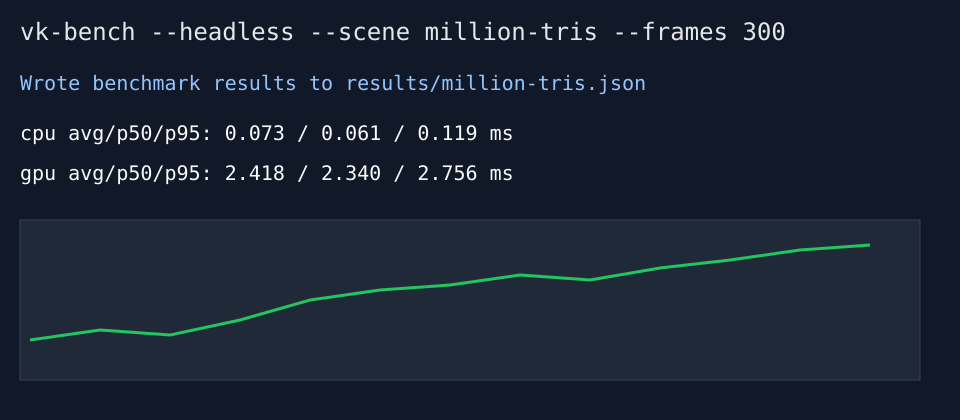
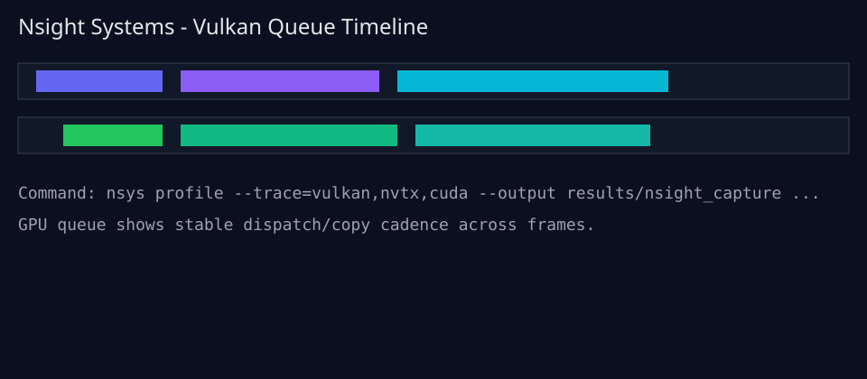

# vk-bench (Level 0 Vulkan micro-benchmark)

**Purpose**

A containerized Vulkan micro-benchmark that renders one controlled workload at a time and produces repeatable performance numbers plus Nsight captures.

## What this benchmarks

This Level 0 repo intentionally scopes to **one executable** (`vk-bench`) and **three micro-scenes**:

- `triangle` (real graphics pipeline rendering one triangle to an offscreen target)
- `million-tris` (graphics raster stress via 1,000,000 triangle instances)
- `compute-copy` (bandwidth-focused transfer load)

No assets, textures, or engine features are included.

Shaders are authored in **Slang** and compiled to SPIR-V during build, then installed next to the executable (`<bin>/shaders`) for cross-platform runtime lookup.

## How to run

```bash
docker build -t vk-bench .
docker run --rm --gpus all -e DISPLAY=$DISPLAY -v /tmp/.X11-unix:/tmp/.X11-unix vk-bench
docker run --rm --gpus all vk-bench --headless --frames 300 --out results.json
```


Scripts default to Docker image `vk-bench`. Override with `VK_BENCH_IMAGE=<image>` if needed.

### Bench all 3 scenes

```bash
scripts/run_bench.sh results  # runs inside Docker image vk-bench
```

## Example results

```json
{
  "scene": "million-tris",
  "cpu_frame_time_ms": {"avg": 0.0731, "p50": 0.0613, "p95": 0.1188},
  "gpu_frame_time_ms": {"avg": 2.4182, "p50": 2.3395, "p95": 2.7560}
}
```



## How timing is measured (CPU/GPU)

- **GPU frame time**: Vulkan timestamp queries (`vkCmdWriteTimestamp`) around the workload command region.
- **CPU frame time (submission)**: host timer around `vkQueueSubmit` call.
- Per-frame values are recorded and summarized as `avg`, `p50`, and `p95` in JSON.

## Nsight steps (exact command)

```bash
scripts/nsight_capture.sh results/nsight_capture  # profiles docker run
```

Or directly:

```bash
nsys profile --trace=vulkan,nvtx,cuda --output results/nsight_capture \
  docker run --rm --gpus all -v "$(pwd)/results:/results" vk-bench \
  --headless --scene million-tris --warmup 20 --frames 120 --out /results/nsight_capture.json
```



## Container GPU access options

### Option A: Linux host + NVIDIA (recommended)

- Use `--gpus all`.
- Verify loader + ICD in-container:

```bash
docker run --rm --gpus all vk-bench vulkaninfo --summary
```

### Option B: Headless-only explicit ICD config

If automatic ICD discovery is unavailable, set:

```bash
export VK_ICD_FILENAMES=/usr/share/vulkan/icd.d/nvidia_icd.json
vk-bench --headless --frames 300 --out results.json
```

## Known limitations

- Triangle and million-tris scenes render offscreen (headless-friendly) and do not create a swapchain/windowed present path yet.
- CI can validate build/formatting but not real GPU benchmark values unless run on a self-hosted GPU runner.
